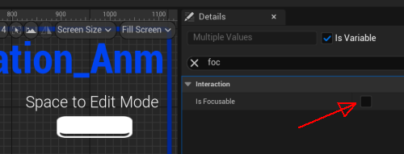
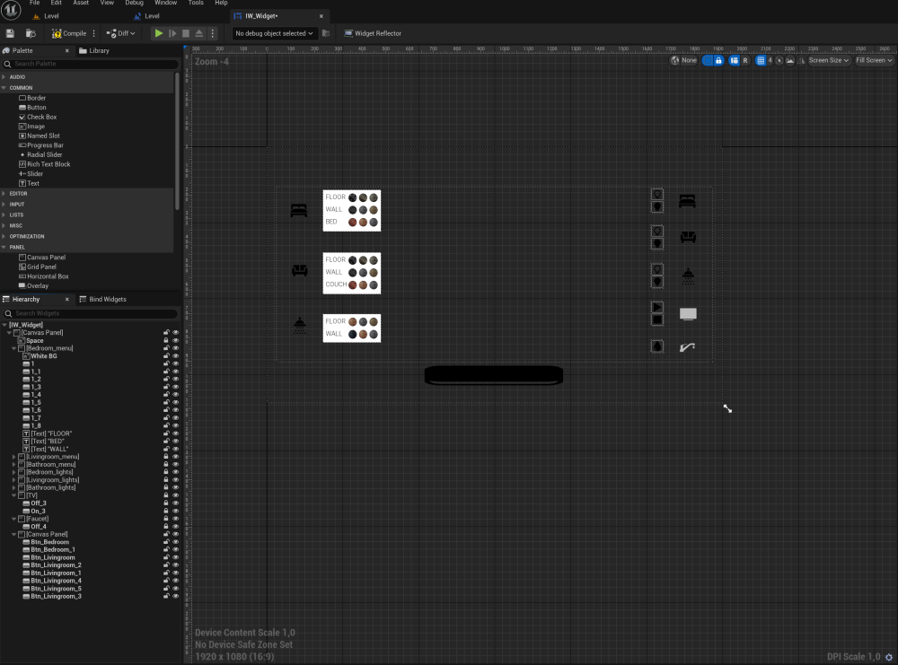
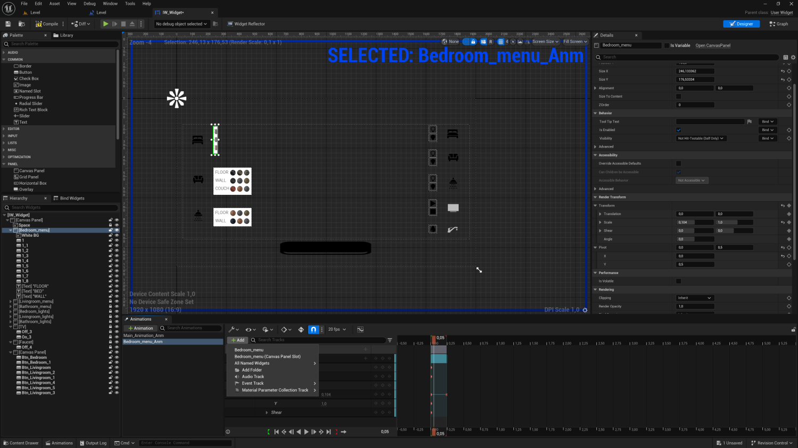
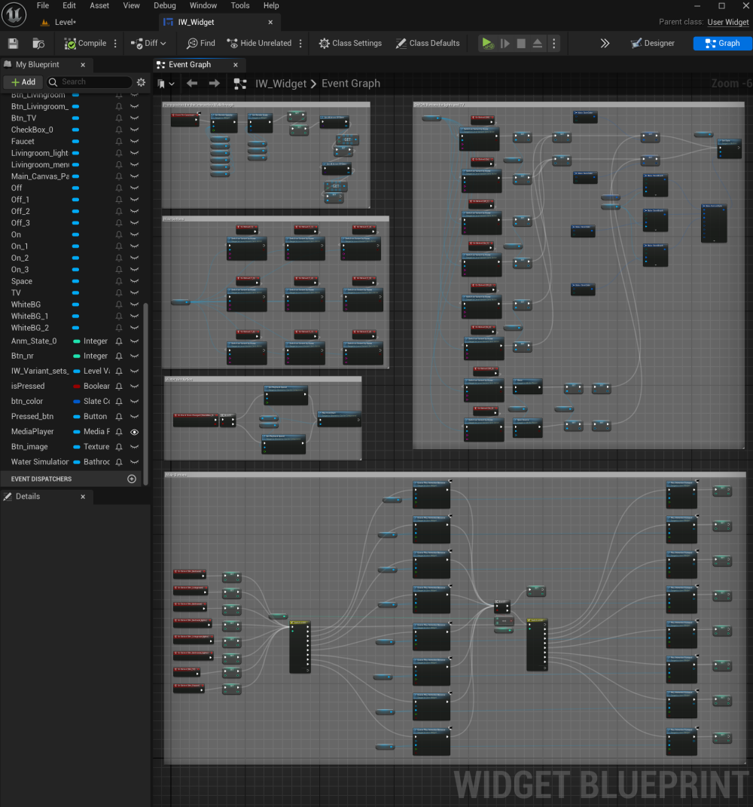
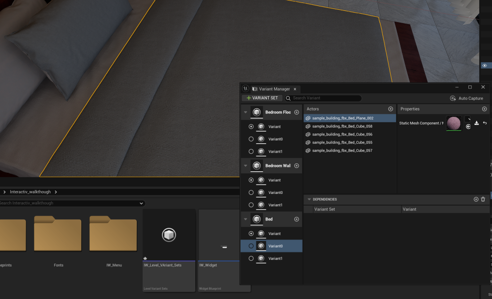
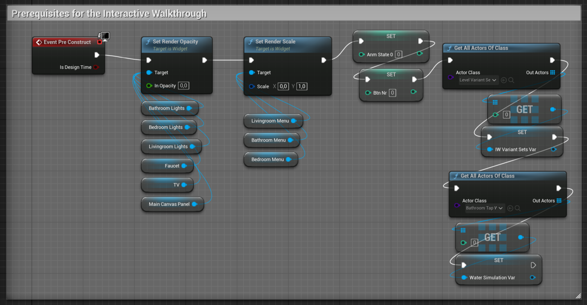
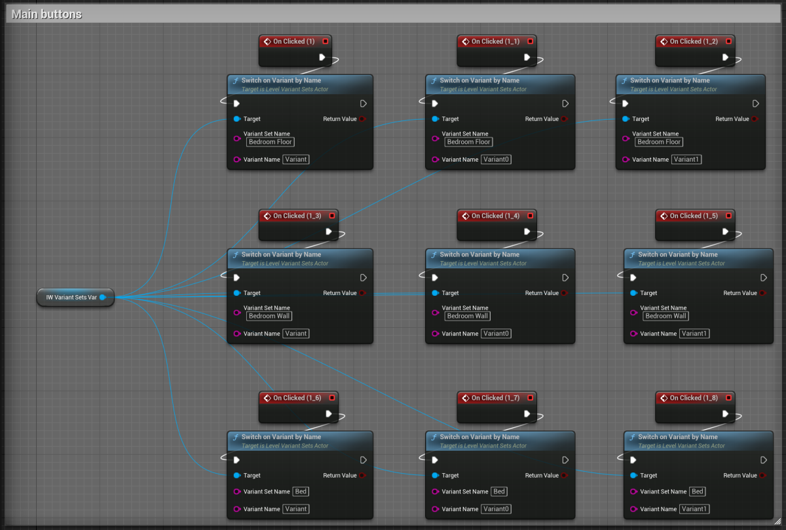
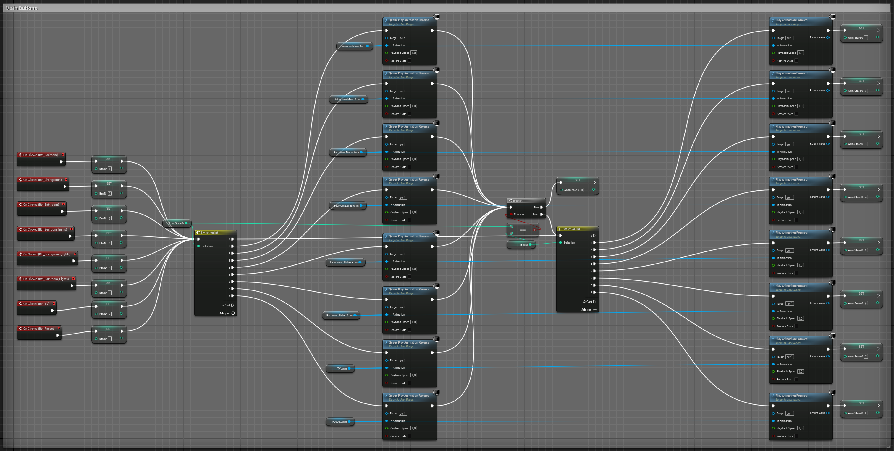
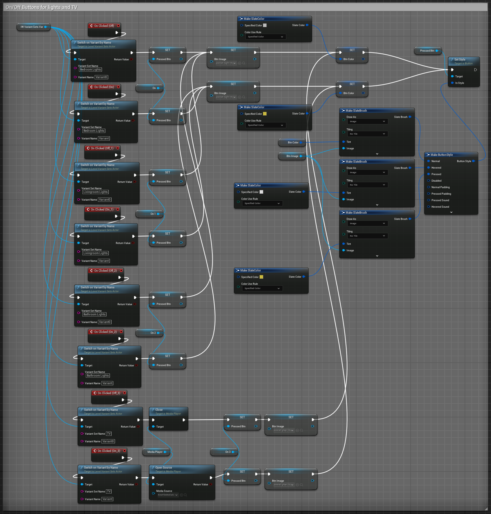
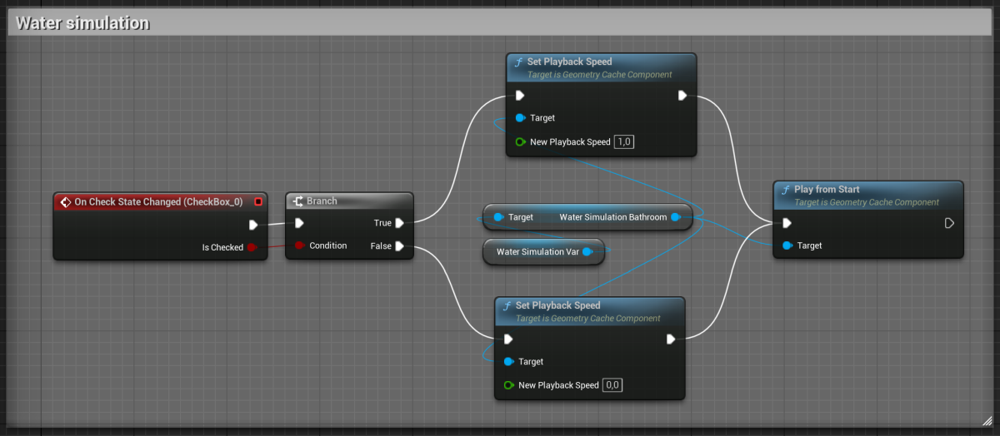

# Interactive Walkthrough Guide for ArchViz Projects in Unreal Engine

## Introduction

I have uploaded the main Unreal files to help reproduce parts of this guide more easily. However, please be aware that there may be issues with importing them into your project. To ensure everything works correctly:

1. **Create a BP Player:**
   - Follow the steps outlined in this guide [Adding First Person Game Mode](https://github.com/accaderi/Unreal-Engine-Quick-Guide-for-Architects?tab=readme-ov-file#adding-first-person-game-mode) to create and activate a Blueprint (BP) player.

2. **Copy Level Blueprint Graph:**
   - Copy the graph from the provided `Level_blueprint` and paste it into your project's Level Blueprint.

3. **Fix IW_Level_Variant_Sets:**
   - In the `IW_Level_Variant_Sets`, the reference actors may appear broken. You can delete these broken references and load new actors with the desired properties to replace them.

### Notes:
- **Reproducibility:** Everything in the guide is reproducible.
- **Primary Goal:** The main objective of this guide is to assist architects in creating menus for their ArchViz projects in Unreal Engine.

## Menu

### Designer Tab (Top Right Corner)

1. **Set the Screen Size**: Choose between 1080p or 4K.
2. **Add a Canvas**: Drag and drop a canvas onto the editor field.
3. **Add Static Images**: Drag and drop images for static elements.
4. **Add Buttons**: Drag and drop buttons for interactive elements.
5. **Set Button Images**: Assign images for the Normal, Hover, and Clicked states of the buttons.
   - Optionally, change the hover state to a highlight by applying a 100% white tint.
   - Adjust the size according to the image dimensions.
6. **Important Note**: If you're using the Space Bar for functions like opening the IW menu, ensure that the buttons used in the menu have `Interaction > Is Focusable` unchecked. This prevents the Space Bar from triggering a button click.  

### Button Groups

1. **Add a Canvas for Grouping**: Drag and drop a Canvas and place buttons onto it.
2. **Ensure Proper Hierarchy**: Make sure that the objects placed on these canvases are the children of the corresponding canvases.
3. **Lock Final Elements**: Lock elements that are finalized and should not be changed.
   - **Important Note**: When you need to modify the properties of an item, it must be unlocked first!  
   

### Adding Animations

1. **Select the Object**: Choose the object you want to animate.
2. **Open the Animation Window**: Go to `Window > Animation`.
3. **Create an Animation**: Click `+Animation`.
4. **Add a Track**: Click `+Add` and select the top option (the selected group in the Hierarchy tab).
5. **Select Properties to Animate**: For example, search for "opacity" and select `Render Opacity`.
6. **Add Keyframes and Values**: Insert keyframes and values to achieve the desired animation effect.  

### Copy/Paste Animations

1. **Copy Animation Items**: Highlight the animation items you want to copy and press `Ctrl + C`.
2. **Paste Animation Items**: Navigate to the target animation track, highlight the track name, and press `Ctrl + V`.
3. **Check Variable Usage**: Ensure the `Is Variable` option is checked for all elements (Buttons, Checkboxes, Canvases, etc.) that need to be used in the Graph Tab.

### Graph Tab (Top Right Corner)

### Level Variants

- **Purpose**: Use this feature to change materials or other properties from the menu.
  
1. **Create a Level Variant Set**: Right-click in the folder, select `Miscellaneous > Level Variant Sets`, and open it.
2. **Add a Variant Set**: Click `+Variant Set` and `+` on the Variant Set.
3. **Assign Actors**: Drag the required actors from the outliner to the actors section.
4. **Select Properties**: Search for and select the properties you wish to modify, such as `material` (`Static Mesh Component > Material[0]`) for all variants. You can use `Ctrl + C` and `Ctrl + V` or `Ctrl + D` to duplicate settings.  

### Button Logic for Level Variants

1. **Add Node**: Create an `Event Pre Construct` node and connect `Get All Actors Of Class`, selecting `Actor Class: LevelVariantSetsActor` in the widget blueprint.
2. **Promote to Variable**: Drag off from `Out Actors`, use `Get (a copy)[0]`, and promote it to a variable.
3. **Create Button Logic**: Connect `OnClick` to `Switch On Variant By Name`, providing the Variant Set Name and Variant Name. The target should be the promoted variable from the previous step.  
  

### Material Button Groups - Graph Logic

1. **Variable Setup:**
   - **Anim State 0 Variable:** 
     - **Type:** Integer
     - **Purpose:** Tracks which window is currently open. Default value is `0` (indicating no open window).
   - **Btn Nr Variable:**
     - **Type:** Integer
     - **Purpose:** Stores the button that was clicked.

2. **Graph Logic:**

   - **Button Clicked Event:**
     - When a button is clicked, the clicked button is registered in the `ClickedButton` variable.

   - **First Switch Node (Based on AnimState0):**
     - This node checks the `AnimState0` variable to determine if any window is currently open.
     - If a window is open, it closes the corresponding window.
     - If no window is open, it proceeds to the second switch node.

   - **After Closing the Open Window:**
     - The logic checks whether the same window button was clicked or another window's button was clicked.
     - If the same window's button was clicked, set the `AnimState0` variable to `0` (indicating no window is open).
     - If another window's button was clicked, the second switch node opens the window corresponding to the clicked button and sets the `AnimState0` variable to the number of the newly opened window.  

### Turning Lights On and Off

1. **Create Variant Set**: Add a new Variant Set.
2. **Select Lights**: Drag the selected lights (e.g., Spotlights) into the Actors section.
3. **Search for Intensity**: Find and modify `intensity` (`Spot Light Component > Intensity`).
4. **Create Node Tree**: Implement the corresponding node tree in the widget graph.  

### Controlling TV On and Off

1. **Follow General Steps**: Implement the general steps for [Display a Video on a TV Object](https://github.com/accaderi/Unreal-Engine-Quick-Guide-for-Architects?tab=readme-ov-file#display-a-video-on-a-tv-object), with slight modifications as shown in the graph in the Turning Lights On and Off section.

### Water Simulation Button

1. **Select Geometry Cache**: In the Outliner tab, select the water simulation geometry cache.
2. **Convert to Blueprint**: Click the Blueprints icon and choose `Convert Selection To Blueprint Class > Harvest Components`.
3. **Rename Geometry Cache**: Rename it to "Water Simulation Bathroom".
4. **Adjust Settings**: Uncheck `Running` and `Looping`, then compile.
5. **Create Graph Logic**: In the IW widget graph, select the Faucet `OnClick` event and add the necessary logic to connect to the Water Simulation variable.  
